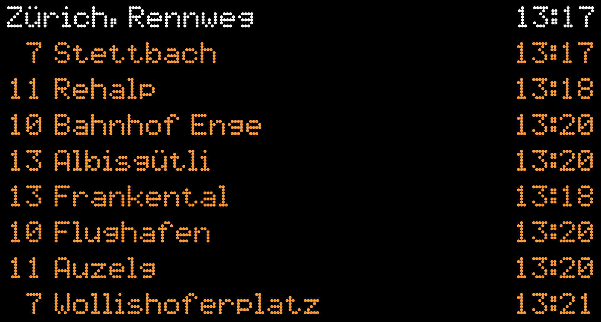

# SwissTransitDisplay

SwissTransitDisplay is a PHP web application which show departures from a Swiss transit stop in realtime.

It uses an [opentransportdata.swiss](https://opentransportdata.swiss/en/dataset/aaa) API and displays departures in dot-matrix-display style.

It looks approximately like this:

## Installation

SwissTransitDisplay runs on any webserver capable of serving PHP and static files, such as PHP/Apache. Copy all files in `src/` into the document root of the webserver.

Furthermore, an API key is needed, which can be obtained for free:

1. Go to [opentransportdata.swiss](https://opentransportdata.swiss/en/register/) and register there.
2. Click on *API keys* in the header bar, and request a new *VDV 431 Default* token.
3. Install the token as described in the **Configuration** section below.

## Configuration

The display can be configured using the `src/config.json` file. An example is present in the `src/config.example.json` file. The following configurations are available:

* **api_key**: The [opentransportdata.swiss](https://opentransportdata.swiss/en/) API key.
* **departure_count**: The number of departures displayed.
* **stop_id**: The DiDok ID of the stop (e.g. 8591316 for "Zürich, Rennweg"). The ID can be found most easily on [this map](https://map.geo.admin.ch/?layers=ch.bav.haltestellen-oev). Click on any transit stop icon, then "More info". The ID can be found in the "Number" field.
* **stop_name**: The name of the stop as display on the top.
* **name_transformations**: An object which can be used to change how certain stops are displayed. For example, "Zürich Enge, Bahnhof" might be changed to "Bahnhof Enge", as it is probably obvious that it is located in Zurich. The key describes the official name as provided by the API and the value can be changed as preferred.